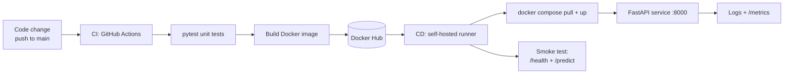

# Cats vs Dogs — End-to-End MLOps Pipeline

MLOps (S1-25_AIMLCZG523) · Assignment 2 · Binary image classification for a pet adoption platform.

An end-to-end pipeline: PyTorch training (ResNet18 transfer learning, with a from-scratch
CNN baseline) with MLflow tracking and DVC data versioning,
a containerized FastAPI inference service, GitHub Actions CI (test → build → push to Docker Hub),
CD to a local Docker Compose deployment via a self-hosted runner, and basic monitoring.

## Architecture



| Concern             | Tool                                                             |
| ------------------- | ---------------------------------------------------------------- |
| Code versioning     | Git + GitHub                                                     |
| Data versioning     | DVC (local remote)                                               |
| ML framework        | PyTorch (CPU), model saved as `.pt`                              |
| Model               | ResNet18 transfer learning (frozen backbone); SimpleCNN baseline |
| Experiment tracking | MLflow                                                           |
| Inference API       | FastAPI + Uvicorn                                                |
| Containerization    | Docker (`python:3.13-slim`, CPU-only torch)                      |
| CI / Registry       | GitHub Actions (pytest → build → push) → Docker Hub              |
| CD                  | GitHub Actions on a **self-hosted runner** → Docker Compose      |
| Monitoring          | Request/latency logging middleware + Prometheus-style `/metrics` |

## Quickstart

```powershell
# 1. Environment
python -m venv .venv
.\.venv\Scripts\Activate.ps1
pip install -r requirements.txt

# 2. Data (DVC-tracked)
dvc pull                                  # or place raw images under data/raw/
python -m src.data.preprocess             # 224x224 RGB, 80/10/10 split

# 3. Train (logs to MLflow, saves models/model.pt)
python -m src.models.train                # architecture set by train.arch in params.yaml
python scripts/sync_results.py            # regenerate the results table below from mlflow.db

# Inspect runs at http://localhost:5000. The backend flag is required: runs are
# tracked in mlflow.db, and MLflow 3.x rejects the default ./mlruns file store.
mlflow ui --backend-store-uri sqlite:///mlflow.db

# 4. Tests (same invocation CI uses)
python -m pytest tests/ -v

# 5. Serve locally
uvicorn app.main:app --port 8000
# or containerized:
docker build -t catsdogs-api .
docker run -p 8000:8000 catsdogs-api
```

## Model performance

<!-- BEGIN RESULTS (generated by scripts/sync_results.py -- do not edit by hand) -->

Four tracked MLflow runs on the same 3,000-image-per-class split (80/10/10, 224x224 RGB, augmented training set) -- three distinct configurations, plus an exact re-run kept as the reproducibility check:

| Run | MLflow run | Architecture | LR | Epochs | Test accuracy | Test F1 |
| --- | ---------- | ------------ | -- | ------ | ------------- | ------- |
| 1 | `melodic-vole-243` | SimpleCNN (from scratch) | 0.001 | 5 | 0.668 | 0.672 |
| 2 | `luxuriant-skunk-711` | SimpleCNN (from scratch) | 0.001 | 5 | 0.668 | 0.672 |
| 3 | `likeable-owl-439` | SimpleCNN (from scratch) | 0.0005 | 8 | 0.678 | 0.735 |
| **4** | **`useful-dog-77`** | **ResNet18 transfer (frozen backbone)** | **0.001** | **4** | **0.983** | **0.983** |

Run 4 (`useful-dog-77`) is the deployed model (`models/model.pt`). Freezing the ImageNet backbone means only the classifier head trains, so it converges in fewer epochs *and* less wall-clock time per epoch than the from-scratch baseline.

Run 2 (`luxuriant-skunk-711`) repeats the configuration of run 1 (`melodic-vole-243`) as a reproducibility check: under `seed: 42` it matches that run's metrics to every decimal place, which is the evidence that training is deterministic.

<!-- END RESULTS -->

## API

| Endpoint    | Method | Description                                            |
| ----------- | ------ | ------------------------------------------------------ |
| `/health`   | GET    | Liveness + model-loaded flag                           |
| `/predict`  | POST   | Multipart image upload → `{label, probabilities}`      |
| `/metrics`  | GET    | Prometheus metrics: request count, latency, predictions|
| `/docs`     | GET    | Interactive Swagger UI                                 |

```powershell
# Use curl.exe: in PowerShell, `curl` is an alias for Invoke-WebRequest, which
# does not accept the -X and -F flags.
curl.exe http://localhost:8000/health
curl.exe -X POST http://localhost:8000/predict -F "file=@tests/assets/sample.jpg"
```

## CI/CD

- **CI** ([.github/workflows/ci.yml](.github/workflows/ci.yml)): every push/PR → pytest → Docker build; on `main` → push `latest` + commit-SHA tags to Docker Hub. Requires repo secrets `DOCKERHUB_USERNAME` and `DOCKERHUB_TOKEN`.
- **CD** ([.github/workflows/cd.yml](.github/workflows/cd.yml)): after CI succeeds on `main`, a **self-hosted runner** on the deployment machine pulls the image and runs `docker compose up -d`, then executes [scripts/smoke_test.py](scripts/smoke_test.py) (health + one prediction). A failing smoke test fails the pipeline.
- Start the runner before pushing, in a normal (non-elevated) PowerShell: `cd C:\actions-runner; .\run.cmd` — wait for "Listening for Jobs".

## Monitoring (M5)

- Every request is logged with method, path, status, and latency (image bytes are never logged).
- `/metrics` exposes `inference_requests_total`, `inference_request_latency_seconds`, and `predictions_total` in Prometheus format.
- Post-deployment model performance: `python scripts/evaluate_batch.py` sends labeled test images to the live service and writes `monitoring/post_deploy_report.md` with live accuracy + confusion matrix. Latest run against the container: **100% on 30 held-out images**.
- Captured evidence: [monitoring/metrics_snapshot.txt](monitoring/metrics_snapshot.txt) (Prometheus output) and [monitoring/service_logs_sample.txt](monitoring/service_logs_sample.txt) (per-request logs with latency).

## Project layout

```
├── README.md
├── requirements.txt          # full dev environment, pinned
├── requirements-api.txt      # runtime-only subset (used by the Dockerfile and CI)
├── params.yaml               # training hyperparameters (incl. train.arch)
├── data/                     # DVC-tracked (raw/ and processed/)
├── src/
│   ├── data/preprocess.py    # 224×224 RGB, 80/10/10 split, corrupt-file filtering
│   ├── models/model.py       # SimpleCNN + ResNet18 transfer architectures
│   ├── models/train.py       # training + MLflow logging
│   └── utils.py              # shared transforms & label maps
├── app/main.py               # FastAPI: /health, /predict, /metrics
├── tests/                    # pytest: preprocessing + inference tests
├── models/model.pt           # trained artifact (committed for the CI image build)
├── Dockerfile / docker-compose.yml
├── .github/workflows/ci.yml  # test → build → push to Docker Hub
├── .github/workflows/cd.yml  # deploy on self-hosted runner + smoke test
├── scripts/                  # smoke_test.py, evaluate_batch.py, sync_results.py, package_submission.py
├── monitoring/               # captured metrics, request logs, post-deploy report
├── reports/                  # generated loss curves + confusion matrix (gitignored)
└── mlruns/ + mlflow.db       # MLflow run history (gitignored, shipped in the zip)
```

## Module map

How the repository covers the five assignment modules:

| Module | Scope | Where |
| ------ | ----- | ----- |
| **M1** | Model development & experiment tracking — DVC data versioning, preprocessing, two architectures, ≥3 tracked MLflow runs, best promoted to `models/model.pt` | [src/data/preprocess.py](src/data/preprocess.py), [src/models/](src/models/), `data/*.dvc`, `mlruns/` |
| **M2** | Packaging & containerization — FastAPI service, pinned dependencies, slim CPU-only image with a healthcheck | [app/main.py](app/main.py), [requirements.txt](requirements.txt), [Dockerfile](Dockerfile) |
| **M3** | CI pipeline — unit tests on every push/PR, then build and push tagged images on `main` | [tests/](tests/), [.github/workflows/ci.yml](.github/workflows/ci.yml) |
| **M4** | CD & deployment — self-hosted runner pulls the image, `docker compose up -d`, smoke test gates the pipeline | [.github/workflows/cd.yml](.github/workflows/cd.yml), [docker-compose.yml](docker-compose.yml), [scripts/smoke_test.py](scripts/smoke_test.py) |
| **M5** | Monitoring & submission — request/latency logging, `/metrics`, post-deployment accuracy report, submission zip | [app/main.py](app/main.py), [monitoring/](monitoring/), [scripts/evaluate_batch.py](scripts/evaluate_batch.py), [scripts/package_submission.py](scripts/package_submission.py) |
